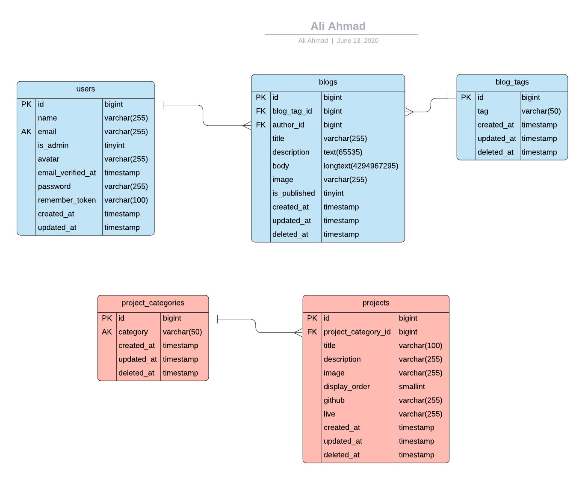

<h1 align="center">Ali Ahmad</h1>

## Credential

username: user@test.com

password: 12345678

## Description
This is Ali's Personal blog and Portfolio being hosted on heruko with MySql server
powered by AWS and AWS s3 storage being in use.

## Database ERD

## Deployment process

- Make sure, you enabled forced ssl in .htaccess file
- Make sure, you run `npm run prod`
- Make sure, you optimize views and routes using `php artisan view:cache` and `php artisan route:cache`
- Now switch to branch master, merge and deploy the project
